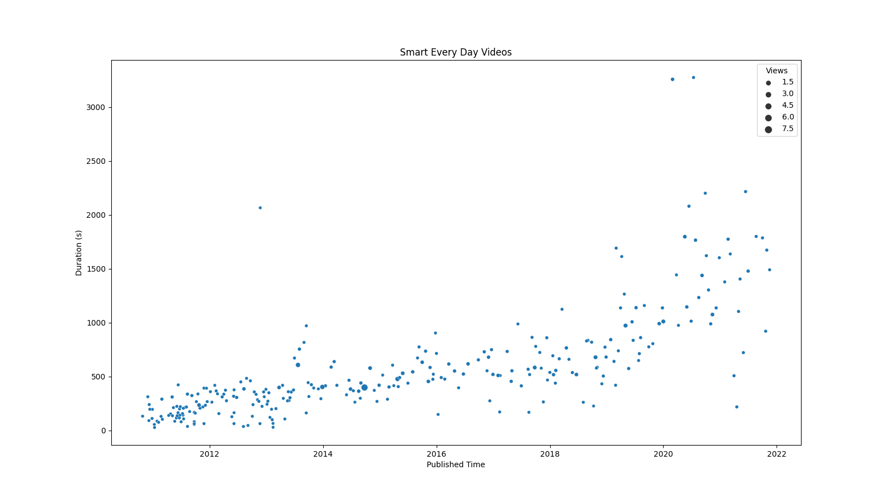

# Smart Every Day Analyser
Python Library for Analysing statistics from the [Smarter Every Day YouTube Channel](https://www.youtube.com/channel/UC6107grRI4m0o2-emgoDnAA)

# Installing

In order to use this do the following:
* Install Python, I have tested this with 3.9.7
* Copy the files from this GitHub repository
* Install the required packages: 
  ```bash
  pip install -r requirements.txt
  ```
* Get a Google API key and store it in a file called ``.google_API_key``, if you are unfamilar with the process, look here: [YouTube Data API Overview](https://developers.google.com/youtube/v3/getting-started) 

# Running
Run the file 
```bash
python SmarterEveryDayAnalyser.py
```
This will create a file call ``SmarterEveryDay.png`` similar to the one below:



